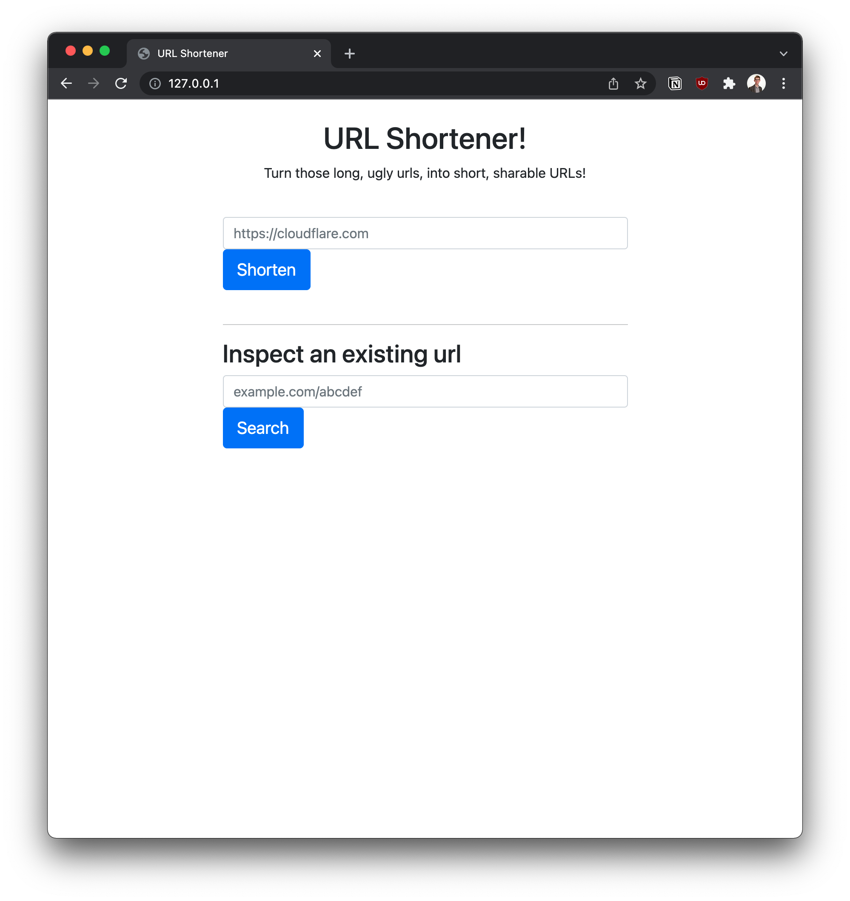
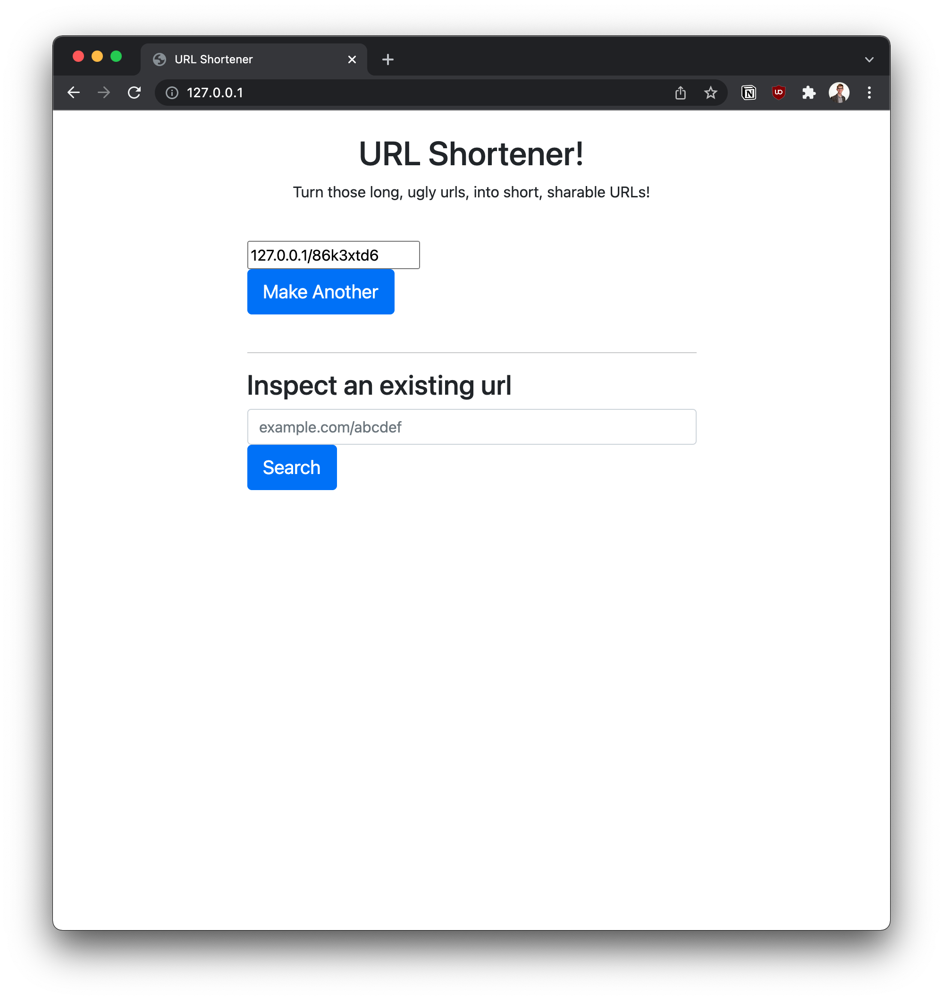
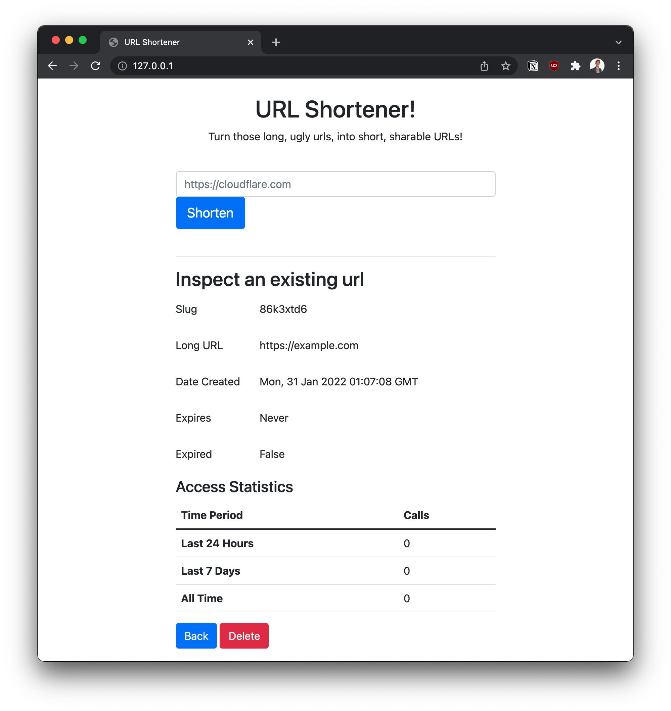

# Flask URL Shortener
Flask version of URL Shortener

## Running Locally
This application can be deployed locally via Docker Compose. Assuming that you have Docker and Docker Compose installed
on your machine, clone this repo to your machine and cd into it. Then run:
```commandline
docker-compose up
```

After the initial launch, you will need to initialize the DB, which can be done via the following command:
```commandline
docker-compose exec web python3 -c "from app import create_app, db; db.create_all(app=create_app()); print('DB Tables Created')"
```

Once you are done, you can stop and remove all the associated containers via:
```commandline
docker-compose down
```

## Using the Service
Users can interface with the service both via an admittedly ugly UI interface, hosted at the root of the service
(example.com), or via a REST API.

Regardless of how the short URL was made, it can be expanded by visiting that url, which if valid, will redirect the
user to the long URL.

## Using the UI


To shorten a URL, enter the long URL in the top input box and either press enter, or click shorten. If you wish to
create a short-lived URL, you will need to use the API.


The short URL is returned and can be copied from the text box and then redistributed as needed.

Details about an existing short URL,including the ability to delete the URL can be found by entering either the short
URL or the slug (the unique 8 characters following the `/`) into the search box and either pressing enter, or clicking
the "Search" button.



## Using the API
### Creating a new Short URL
| HTTP Method | PUT     |
|-------------|---------|
 | Path        | `/slug` |

Example Body:
```json
{
  "long_url": "https://example.com",
  "expires": {
    "days": 1,
    "seconds": 2,
    "microseconds": 3,
    "milliseconds": 4,
    "minutes": 5,
    "hours": 6,
    "weeks": 7
  }
}
```

Only **`long_url`** is a required field.

Example Response:
```json
{
    "short_url": "127.0.0.1/h5tye9df",
    "slug": "h5tye9df"
}
```


### Describing a Short URL
| HTTP Method | GET             |
|-------------|-----------------|
 | Path        | `/slugs/<slug>` |

No request body is required for this path.

Example Response:
```json
{
    "date_created": "Sat, 29 Jan 2022 18:11:19 GMT",
    "expired": true,
    "expires": "Sat, 29 Jan 2022 18:11:26 GMT",
    "long_url": "https://tompaulus.com",
    "slug": "h5tye9df",
    "stats": {
        "all_time": 1,
        "last_day": 1,
        "last_week": 1
    }
}
```

### Deleting a Short URL
| HTTP Method | DELETE          |
|-------------|-----------------|
 | Path        | `/slugs/<slug>` |

No request body is required for this path. No response body will be provided.

## Design Decisions
### Database
My normal DB of choice is Amazon DynamoDB, a Key-Value datastore, which can be run locally in addition to in the cloud,
but would make the statistics part of this project rather difficult (not impossible, it would just require a fair number
of periodic tasks to aggregate the data into the different formats we would want). 

Postgres seemed like an okay fit here since it will scale well to our needs for this internal application, and I have
some, although old, experience interfacing with it. We can run it locally, thanks to a Docker Container, and in the
cloud, either managing the cluster ourselves, or using something like Amazon Aurora. In a production setting, we would
want to split the DB Connection pool to have both sessions for the leader node, as well a pool for the followers so that
read only traffic could be directed to the readers to reduce load on the writers.

Long term, it may be necessary to implement an aggregation function for the Access Table to flatten the old records if
we do not ever want to provide more granularity than 24-hours, 7-days, and all time to reduce the size and number of
records in that table.

### Access Logging
Keeping track of how often a given short URL is accessed was a key requirement for this project. The simplest approach
(which was implemented here) is to add an item to the DB for every time the record is accessed and then selecting across
a time range to identify the number of times it was accessed.

In a large scale setting, this may prove problematic, since every expansion involves a DB Write. If additional
performance is required, the system could be changed to save the access logs to disk, with a periodic process running
every 5 minutes pushing the latest records to the DB. This would enable the leader node to fail completely, and while
new short urls would not be able to be created, existing URLs would continue to work and the access logs would not be
lost, as the log pusher would buffer the logs on the web host until the DB leader becomes available again.

### Link Expiry
From a customer perspective, if we treat an expired link the same as a link that does not exist, and return a 404,
it's difficult to say if the URL was entered wrong, or if it was expired. Additionally, Postgres does not have a nice
built-in way to handle the deletion of these records for us, so an external process (e.g. cron task) would periodically
need to evict the expired records.


# Development
To bring up the stack and force a rebuild of the built containers (the flask application in this instance), run the
following:
```commandline
docker-compose up --build
```

You'll want to run all the other steps listed in the Running Locally section as well, like initializing the database, 
unless you like Service Internal Errors.

### Making changes
You'll want to set up a venv and install the relevant dependencies as specified in the requirements.txt file. Many IDEs
(like PyCharm) will help you do this.

### Testing
Due to the dependency on the Postgres DB, the unit tests in this package are actually integration tests. With a fair bit
of effort to run the tests in a container along with a DB instance, they could be converted to true unit tests. Before 
running PyTest, ensure the stack is up and happy (via `docker-compose up`).

Run Tests via:
```commandline
pytest
```

Flake and MyPy have also been configured to provide PEP8 validation and static analysis of types to prevent terrible
mistakes, those can be run in addition to the unit tests by adding the relevant args to the `pytest` call. To run
everything, run:
```
pytest --flake8 --mypy
```

## Security
This is NOT a production application and should not be used in a production setting without some significant changes.
Risks with the application as implemented:
* Any user can get the details for a short URL, and delete it, even if they were not the one to create the short URL initially.
* The application should be resilient to SLQ Injection Attacks via the ORM's (SQLAlchemy) protections, but this has not been verified.
* There is no rate-limiting on any of the APIs, allowing an attacker to very easily break things from a single endpoint.

# Project Requirements
A short URL:
-   Has one long URL
-   This URL shortener should have a well-defined API for URLs created, including analytics of usage.
-   No duplicate URLs are allowed to be created.
-   Short links can expire at a future time or can live forever.

Your solution must support:
-   Generating a short url from a long url
-   Redirecting a short url to a long url.
-   List the number of times a short url has been accessed in the last 24 hours, past week, and all time.
-   Data persistence ( must survive computer restarts)
-   Metrics and/or logging: Implement metrics or logging for the purposes of troubleshooting and alerting. This is optional.
-   Short links can be deleted

Project Requirements:
-   This project should be able to be runnable locally with some simple instructions
-   This project's documentation should include build and deploy instruction
-   Tests should be provided and able to be executed locally or within a test environment.